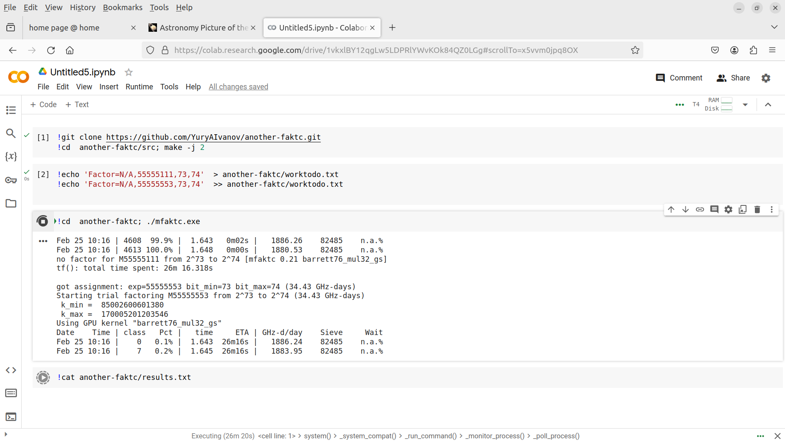
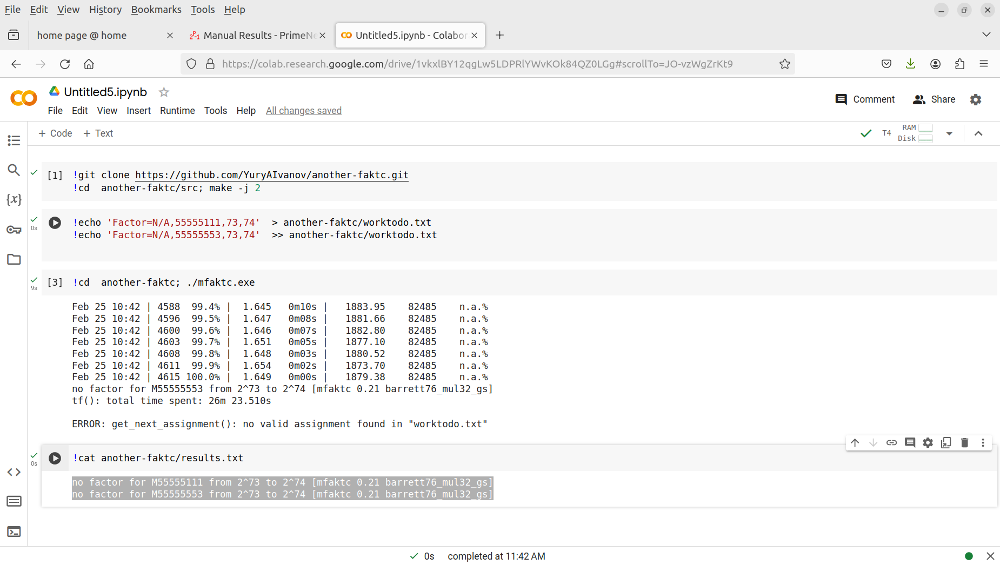

[open here](https://colab.research.google.com/) and run following commands: 

```
!git clone https://github.com/YuryAIvanov/trial-factoring-environment.git
!wget https://www.mersenneforum.org/mfaktc/mfaktc-0.21/mfaktc-0.21.tar.gz
!tar -xvf mfaktc-0.21.tar.gz
!cd mfaktc-0.21/ && git apply ../trial-factoring-environment/update_cc.patch
!cd mfaktc-0.21/src && make -j 2 && cd .. && stat ./mfaktc.exe

```

```
!echo 'Factor=N/A,999154589,75,76'  > mfaktc-0.21/worktodo.txt
!cd mfaktc-0.21/ && ./mfaktc.exe
```

```
!cat mfaktc-0.21/results.txt
```

```
!rm mfaktc-0.21/results.txt
```

## Imaginarium





